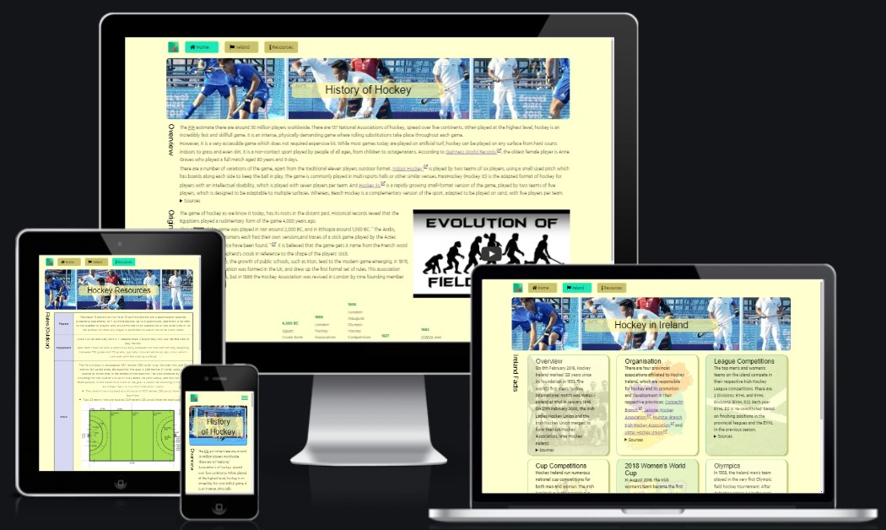

# Hockey History

Hockey History provides a brief history of the game of field hockey, outlining key events in the development of the game.
It also provides additional details related to the game in Ireland. 
The resources page provides links to Irish and international organisations and resources, which support the development of the game.

The site is aimed at both sports enthusiasts and history scholars. The aim is to provide a history of the game, as well as acting as a useful resource.

##### Fig 1: Responsive Mockup

## Features 

In this section, you should go over the different parts of your project, and describe each in a sentence or so. You will need to explain what value each of the features provides for the user, focusing on who this website is for, what it is that they want to achieve and how your project is the best way to help them achieve these things.

### Existing Features

- __Navigation Bar__

  - Featured on all three pages, the full responsive navigation bar includes links to the Logo, Home page, Gallery and Sign Up page and is identical in each page to allow for easy navigation.
  - This section will allow the user to easily navigate from page to page across all devices without having to revert back to the previous page via the ‘back’ button. 

- __The landing page image__

  - The landing includes a photograph with text overlay to allow the user to see exactly which location this site would be applicable to. 
  - This section introduces the user to Love Running with an eye catching animation to grab their attention

- __Club Ethos Section__

  - The club ethos section will allow the user to see the benefits of joining the Love Running meetups, as well as the benefits of running overall. 
  - This user will see the value of signing up for the Love Running meetups. This should encourage the user to consider running as their form of exercise. 

- __Meetup Times section__

  - This section will allow the user to see exactly when the meetups will happen, where they will be located and how long the run will be in kilometers. 
  - This section will be updated as these times change to keep the user up to date. 

- __The Footer__ 

  - The footer section includes links to the relevant social media sites for Love Running. The links will open to a new tab to allow easy navigation for the user. 
  - The footer is valuable to the user as it encourages them to keep connected via social media

- __Gallery__

  - The gallery will provide the user with supporting images to see what the meet ups look like. 
  - This section is valuable to the user as they will be able to easily identify the types of events the organisation puts together. 

- __The Sign Up Page__

  - This page will allow the user to get signed up to Love Running to start their running journey with the community. The user will be able specify if they would like to take part in road, trail or both types of running. The user will be asked to submit their full name and email address. 

For some/all of your features, you may choose to reference the specific project files that implement them.

In addition, you may also use this section to discuss plans for additional features to be implemented in the future:

### Features Left to Implement

- Another feature idea

## Design 
The design specification is available in [design.md](design/design.md).

## Testing 

In this section, you need to convince the assessor that you have conducted enough testing to legitimately believe that the site works well. Essentially, in this part you will want to go over all of your project’s features and ensure that they all work as intended, with the project providing an easy and straightforward way for the users to achieve their goals.

In addition, you should mention in this section how your project looks and works on different browsers and screen sizes.

You should also mention in this section any interesting bugs or problems you discovered during your testing, even if you haven't addressed them yet.

If this section grows too long, you may want to split it off into a separate file and link to it from here.

### Accessibility
Accessibility testing was carried out using the [NVDA](https://www.nvaccess.org/) and [ChromeVox](https://chrome.google.com/webstore/detail/screen-reader/kgejglhpjiefppelpmljglcjbhoiplfn?hl=en) screen readers.

### Validator Testing 

| Page | Home | Ireland | Resources | Built With |
|------|------|---------|-----------|------------|
| HTML | [W3C validator](https://validator.w3.org/nu/?showsource=yes&doc=https%3A%2F%2Fibuttimer.github.io%2Fhockey-history%2Findex.html) | [W3C validator](https://validator.w3.org/nu/?showsource=yes&doc=https%3A%2F%2Fibuttimer.github.io%2Fhockey-history%2Fireland.html) | [W3C validator](https://validator.w3.org/nu/?showsource=yes&doc=https%3A%2F%2Fibuttimer.github.io%2Fhockey-history%2Fresources.html) | [W3C validator](https://validator.w3.org/nu/?showsource=yes&doc=https%3A%2F%2Fibuttimer.github.io%2Fhockey-history%2Fbuiltwith.html) |
| Result | &check;/&cross; | &check;/&cross; | &check;/&cross; | &check;/&cross; |
| CSS | [(Jigsaw) validator](https://jigsaw.w3.org/css-validator/validator?uri=https%3A%2F%2Fibuttimer.github.io%2Fhockey-history%2Findex.html&profile=css3svg&usermedium=all&warning=1&vextwarning=&lang=en) | [(Jigsaw) validator](https://jigsaw.w3.org/css-validator/validator?uri=https%3A%2F%2Fibuttimer.github.io%2Fhockey-history%2Fireland.html&profile=css3svg&usermedium=all&warning=1&vextwarning=&lang=en) | [(Jigsaw) validator](https://jigsaw.w3.org/css-validator/validator?uri=https%3A%2F%2Fibuttimer.github.io%2Fhockey-history%2Fresources.html&profile=css3svg&usermedium=all&warning=1&vextwarning=&lang=en) | [(Jigsaw) validator](https://jigsaw.w3.org/css-validator/validator?uri=https%3A%2F%2Fibuttimer.github.io%2Fhockey-history%2Fbuiltwith.html&profile=css3svg&usermedium=all&warning=1&vextwarning=&lang=en) |
| Result | &check;/&cross; | &check;/&cross; | &check;/&cross; | &check;/&cross; |

### Unfixed Bugs

You will need to mention unfixed bugs and why they were not fixed. This section should include shortcomings of the frameworks or technologies used. Although time can be a big variable to consider, paucity of time and difficulty understanding implementation is not a valid reason to leave bugs unfixed. 

## Deployment

The site was deployed as a static website, hosted directly from the GitHub repository via [GitHub Pages](https://pages.github.com/).

The following steps were followed to deploy the website: 
  - Navigate to the `Settings` tab in the GitHub repository
  - Under the `Code and automation` section, select `Pages`
  - Under `Source`, select `main` from the Branch dropdown menu
  - Once the website is published, the page will refresh indicting the successful deployment, and providing link to the live website. 

The live website is available at [https://ibuttimer.github.io/hockey-history/](https://ibuttimer.github.io/hockey-history/)

## Credits 

The following resources were used to build the website.

### Content 

- The text for the Home page was taken from Wikipedia Article A
- The icons on the site were taken from [Font Awesome](https://fontawesome.com/)
- The favicon for the site was generated by [favicon.io](https://favicon.io/)
- The timeline is based on [this example](https://codepen.io/joemaffei/pen/WNQKyPo) by [Joe Maffei](https://stackoverflow.com/users/4642023/joe-maffei) from [stackoverflow](https://stackoverflow.com/a/61781360), customised, adapted to meet [W3C Nu Html Checker](https://validator.w3.org/nu/) standards and made responsive.

### Media

- Hero image by [BugWarp - Own work](https://commons.wikimedia.org/w/index.php?curid=75142522), [CC BY-SA 4.0](https://creativecommons.org/licenses/by-sa/4.0/), cropped
- Hero image layout based on CodeInstitute: LR101, Love Running - Essentials Project  
- The [Responsive Mockup](#fig-1-responsive-mockup) image was generated courtesy of [Am I Responsive](http://ami.responsivedesign.is/)
- [Hockey field image](https://commons.wikimedia.org/wiki/File:Hockey_field_metric.svg), Hockey_field.svg: User Robert Merkel on en.wikipedia, derivative work: Lcmortensen, Public domain, via Wikimedia Commons, derivative work: landscape, updated labels, length and width dimensions
- Maps by [FreeVectorMaps.com](https://freevectormaps.com/), [Attribution License (Free)](https://freevectormaps.com/license), cropped, transparent background
- Hamburger menu based on [Responsive CSS Hamburger Menu - CSS only](https://codepen.io/alvarotrigo/pen/MWEJEWG) from [10+ Hamburger Menu Examples &#xff3b;CSS Only&#xff3d; by Luke Embrey](https://alvarotrigo.com/blog/hamburger-menu-css/)

## Other General Project Advice

Below you will find a couple of extra tips that may be helpful when completing your project. Remember that each of these projects will become part of your final portfolio so it’s important to allow enough time to showcase your best work! 

- One of the most basic elements of keeping a healthy commit history is with the commit message. When getting started with your project, read through [this article](https://chris.beams.io/posts/git-commit/) by Chris Beams on How to Write  a Git Commit Message 
  - Make sure to keep the messages in the imperative mood 

- When naming the files in your project directory, make sure to consider meaningful naming of files, point to specific names and sections of content.
  - For example, instead of naming an image used ‘image1.png’ consider naming it ‘landing_page_img.png’. This will ensure that there are clear file paths kept. 

- Do some extra research on good and bad coding practices, there are a handful of useful articles to read, consider reviewing the following list when getting started:
  - [Writing Your Best Code](https://learn.shayhowe.com/html-css/writing-your-best-code/)
  - [HTML & CSS Coding Best Practices](https://medium.com/@inceptiondj.info/html-css-coding-best-practice-fadb9870a00f)
  - [Google HTML/CSS Style Guide](https://google.github.io/styleguide/htmlcssguide.html#General)

Getting started with your Portfolio Projects can be daunting, planning your project can make it a lot easier to tackle, take small steps to reach the final outcome and enjoy the process! 
