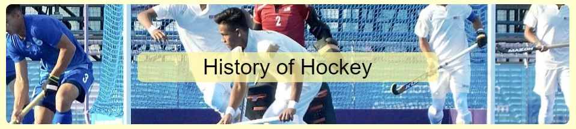
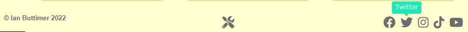
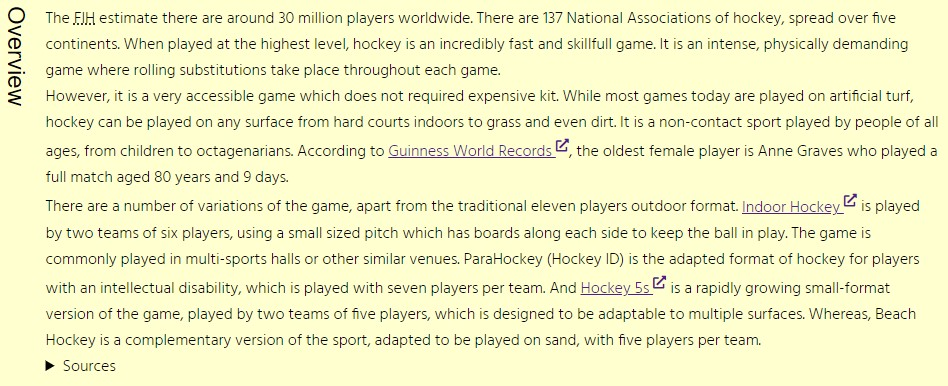
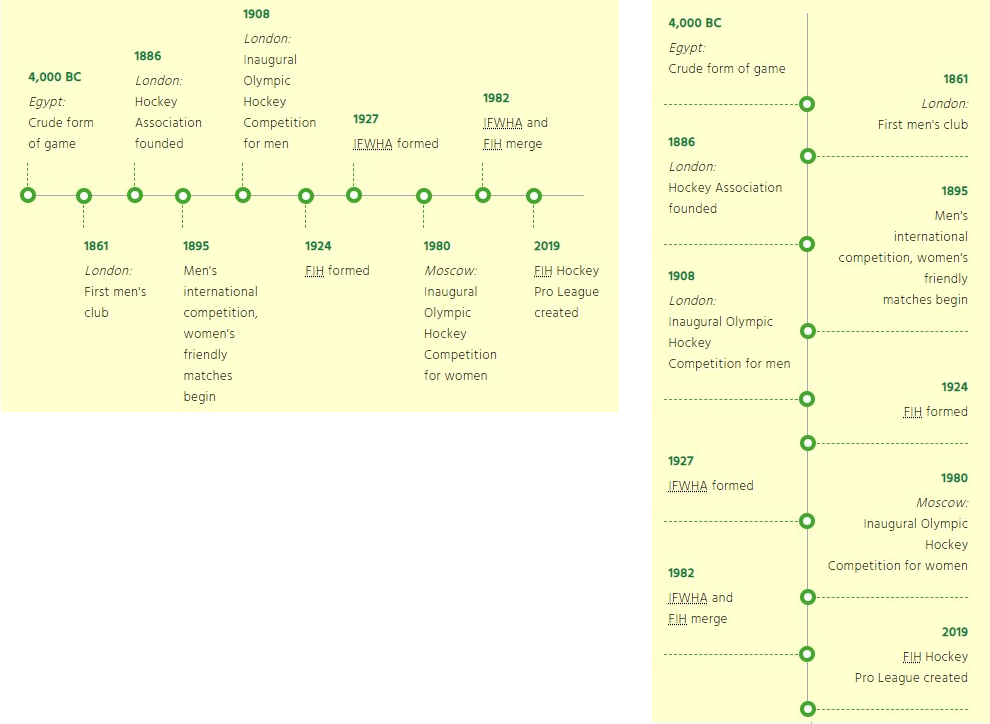
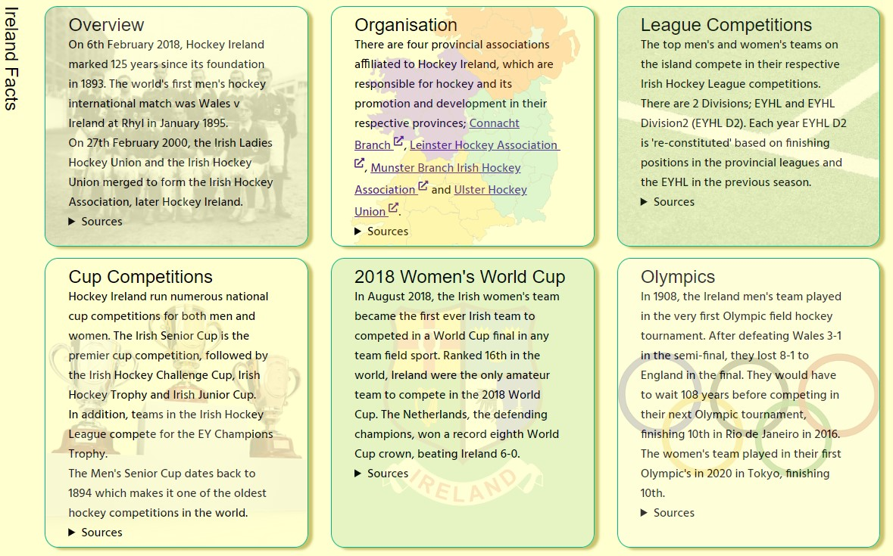

# Hockey History

Hockey History provides a brief history of the game of field hockey, outlining key events in the development of the game.
It also provides additional details related to the game in Ireland. 
The `Resources` page provides links to Irish and international organisations and resources, which support the development of the game.

The site is aimed at both sports enthusiasts and history scholars. The aim is to provide a history of the game, as well as acting as a useful resource.

###### Fig 1: Responsive Mockup

## Features 

### Existing Features
#### Common Features

- __Navigation Bar__

  - The fully responsive navigation bar provides navigation to all the main pages; `Home`, `Ireland` and `Resources`. The current page is highlighted for easy indentification and users can easily navigate to the other pages.
  - The HTML code is contained on each page, and the CSS is in [styles-nav.css](assets/css/styles-nav.css).

###### Fig 2: Navigation Bar

- __The landing page image__

  - The main image on the landing page consists of a photograph with text overlay to allow the user to see the purpose of this site. 
  - When loaded an animation is used to attract the users attention. However, when the user has specified they prefers reduced motion, a simple fade in animation is used.

###### Fig 3: Hero Image

- __The Footer__ 

  - The footer section includes links to social media sites via icons, which open to a new tab to allow easy navigation for the user. 
  - The social media links serve as a call to action to the user to stay engaged with the site.
  - A link to the `Built With` page is provided for users interested in the information sources and resources used on this site.
  - The link icons have tooltips, should users be unfamiliar with a particular icon.
  - The HTML code is contained on each page, and the CSS is in [styles-footer.css](assets/css/styles-footer.css).

###### Fig 4: Footer

#### Main Page
- __Overview Section__

  - This section provides a brief overview of the game, including its popularity and reasons to enjoy the sport. 

###### Fig 5: Overview Section

- __Origins Section__

  - This section details a brief bird's eye view of the origins of hockey.
  - An embedded YouTube video provides a visual record of the evolution of modern hockey.

###### Fig 6: Origins Section

- __Timeline Section__

  - The timeline provided in this section gives key dates in the history of the game.
  - The timeline is responsive, switching from horizontal to vertical on smaller screens.

###### Fig 7: Timeline Section

- __Main Page Code__

  The `Main` page code is in [index.html](index.html).

#### Ireland Page

- __Ireland Facts Section__

  - The `Ireland` page provides a series of information cards with interesting hockey facts specifically related to Ireland. 
  - Each card provides a small description intended to inform. 

###### Fig 8: Ireland Facts Section

- __Ireland Code__

  The `Ireland` page code is in [ireland.html](ireland.html).

#### Resources Page

- __Rules Section__

  - This section provides a brief overview of the rules of hockey and a link to the full rules book. 
  - The pitch image acts as a link to [Pitch Page](#pitch-page)

###### Fig 9: Rules Section

- __Organisations Section__

  - This section provides a links to national and international hockey organisations. 
  - Hovering over a specific card, reveals the links, which open in new tabs.

###### Fig 10: Organisations Section

#### Pitch Page

- __Pitch Section__

  - This section consists of a large scale image, with the dimensions, line markings and key field area definitions.

###### Fig 11: Pitch Section

#### Built With Page

- __Built With Section__

  - This section lists the resources used to develop the site.

- __Information Sources Section__

  - This section lists the information sources for each section of the site.

### Features Left to Implement

- Add additional content.
- Float article content around rotated titles to increase screen space utilisation.
- Use horizontal article titles on narrow screen widths.

## Design 
The design specification is available in [design.md](design/design.md).

## Testing 
Details of the testing undertaken are outlined in [test.md](test/test.md), along with the results.

## Deployment

The site was deployed as a static website, hosted directly from the GitHub repository via [GitHub Pages](https://pages.github.com/).

The following steps were followed to deploy the website: 
  - Navigate to the `Settings` tab in the GitHub repository
  - Under the `Code and automation` section, select `Pages`
  - Under `Source`, select `main` from the Branch dropdown menu
  - Once the website is published, the page will refresh indicting the successful deployment, and providing link to the live website. 

The live website is available at [https://ibuttimer.github.io/hockey-history/](https://ibuttimer.github.io/hockey-history/)

## Credits 

The following resources were used to build the website.

### Content 

- The information sources for the site are listed in the [Information Sources](https://ibuttimer.github.io/hockey-history/builtwith.html#information-sources) Section of the `Built With` Page.
- The icons on the site were taken from [Font Awesome](https://fontawesome.com/)
- The favicon for the site was generated by [favicon.io](https://favicon.io/)
- The timeline is based on [this example](https://codepen.io/joemaffei/pen/WNQKyPo) by [Joe Maffei](https://stackoverflow.com/users/4642023/joe-maffei) from [stackoverflow](https://stackoverflow.com/a/61781360), customised, adapted to meet [W3C Nu Html Checker](https://validator.w3.org/nu/) standards and made responsive.
- Tooltips courtesy of [CSS Tooltip Generator](https://www.cssportal.com/css-tooltip-generator/)
- [YouTube embedded player facade](https://github.com/paulirish/lite-youtube-embed) courtesy of [Paul Irish](https://github.com/paulirish)

### Media

- Hero image by [BugWarp - Own work](https://commons.wikimedia.org/w/index.php?curid=75142522), [CC BY-SA 4.0](https://creativecommons.org/licenses/by-sa/4.0/), cropped
- Hero image layout based on CodeInstitute: LR101, Love Running - Essentials Project  
- The [Responsive Mockup](#fig-1-responsive-mockup) image was generated courtesy of [Am I Responsive](http://ami.responsivedesign.is/)
- [Hockey field image](https://commons.wikimedia.org/wiki/File:Hockey_field_metric.svg), Hockey_field.svg: User Robert Merkel on en.wikipedia, derivative work: Lcmortensen, Public domain, via Wikimedia Commons, derivative work: landscape, updated labels, length and width dimensions
- Maps by [FreeVectorMaps.com](https://freevectormaps.com/), [Attribution License (Free)](https://freevectormaps.com/license), cropped, transparent background
- Hamburger menu based on [Responsive CSS Hamburger Menu - CSS only](https://codepen.io/alvarotrigo/pen/MWEJEWG) from [10+ Hamburger Menu Examples &#xff3b;CSS Only&#xff3d; by Luke Embrey](https://alvarotrigo.com/blog/hamburger-menu-css/)
- [Flag of Ireland hockey team image](https://commons.wikimedia.org/wiki/File:Flag_of_Ireland_hockey_team.svg), Caomhan27/Mysid, [CC BY-SA 3.0](https://creativecommons.org/licenses/by-sa/3.0), via Wikimedia Commons
- Pitch lines image by [TaniaRose](https://pixabay.com/users/taniarose-3072581/?utm_source=link-attribution&amp;utm_medium=referral&amp;utm_campaign=image&amp;utm_content=2330582) from [Pixabay](https://pixabay.com/?utm_source=link-attribution&amp;utm_medium=referral&amp;utm_campaign=image&amp;utm_content=2330582)
- Cups image by [Arek Socha](https://pixabay.com/users/qimono-1962238/?utm_source=link-attribution&amp;utm_medium=referral&amp;utm_campaign=image&amp;utm_content=1615074) from [Pixabay](https://pixabay.com/?utm_source=link-attribution&amp;utm_medium=referral&amp;utm_campaign=image&amp;utm_content=1615074)
- [Ireland provinces image](https://commons.wikimedia.org/wiki/File:Ireland_location_provinces.svg), Ireland_location_provinces.jpg: User:Asarlaíderivative work: Ninrouter, Draceane, Public domain, via Wikimedia Commons
- [Ireland team 1908 image](https://commons.wikimedia.org/wiki/File:Ireland_hockey_team_1908.jpg) Unknown author, Public domain, via Wikimedia Commons
- [Olympic rings image](https://commons.wikimedia.org/wiki/File:OLYMPICS_ICON_BY_V.V_ICONS.jpg), Vusi vilanculos, <a href="https://creativecommons.org/licenses/by-sa/4.0">CC BY-SA 4.0</a>, via Wikimedia Commons

