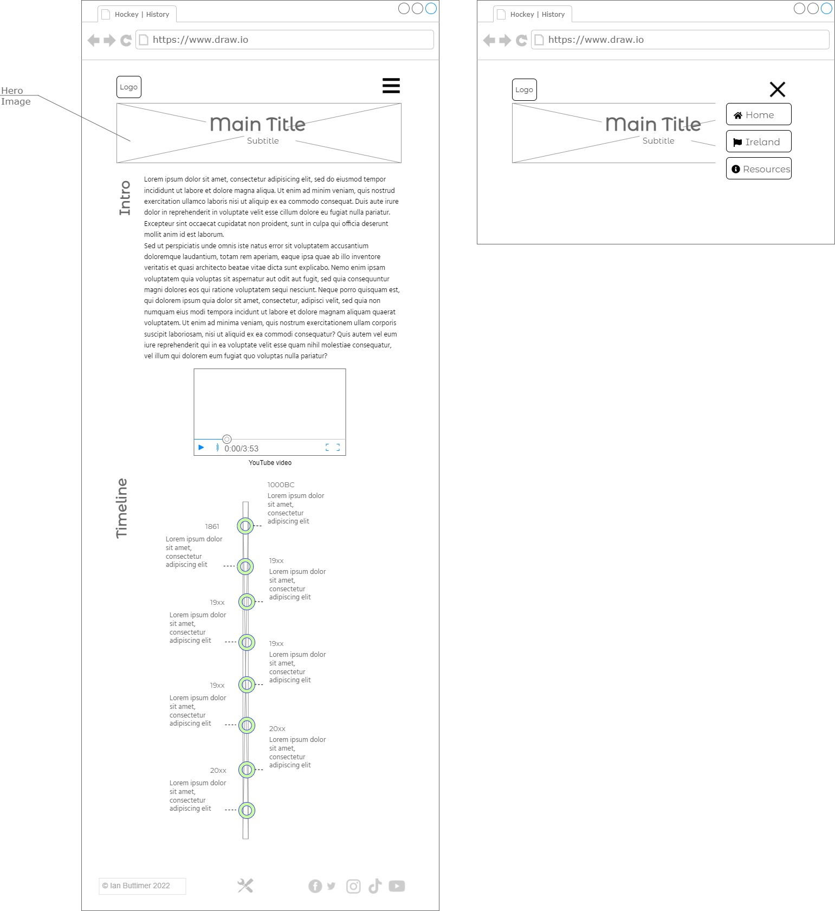
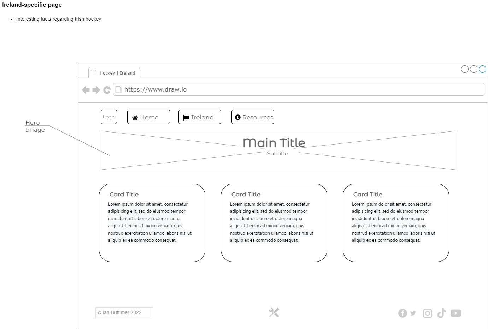
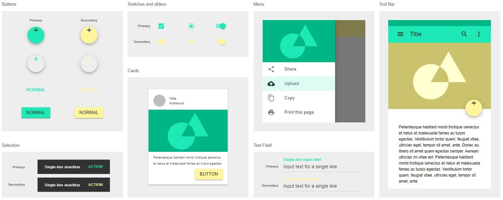

- [Strategy](#strategy)
- [Scope](#scope)
- [Structure](#structure)
- [Skeleton](#skeleton)
- [General layout](#general-layout)
- [Wireframes](#wireframes)
  - [Home page](#home-page)
    - [Large screen](#large-screen)
    - [Medium screen](#medium-screen)
    - [Small screen](#small-screen)
  - [Ireland page](#ireland-page)
  - [Resources page](#resources-page)
  - [Built With page](#built-with-page)
- [UX Surface](#ux-surface)
  - [Font](#font)
  - [Colour Scheme](#colour-scheme)
  - [UX Elements](#ux-elements)
  - [Accessibility](#accessibility)
- [Resources](#resources)
- [To Do](#to-do)
- [Changes](#changes)
  - [20-04-2022](#20-04-2022)
    - [Timeline](#timeline)
  - [26-04-2022](#26-04-2022)
    - [Ireland page](#ireland-page-1)
  - [05-05-2022](#05-05-2022)
    - [Resources page](#resources-page-1)

# Strategy
The strategy is to create a website outlining the history of field hockey. It will provide a brief overview of the development of the game and act as a resource for hockey related information.

# Scope
The website will not host all available content but will provide basic information and links to external resources where appropriate.

# Structure
Due to the low number of pages and the fact the pages will not be inter-dependent, the website will utilise a non-linear hyperlinked navigation structure. 

# Skeleton
The website will consist of four pages:
- Home
  
  Main page with the history of field hockey, a timeline of key events and other facts.
- Ireland

  Ireland-specific page of hockey events and facts.
- Resources

  Page with links to Irish and international organisations, hockey blogs etc.
- Built With

  Page detailing the technologies and resources used to build the website.

# General layout
Each of the pages will have the same general layout:
- Navigation buttons at top of page, with current page highlighted in a different colour. The buttons will contain the appropriate text, and FontAwsome icons will be used to visually represent the function of each page.
- A hero image, overlayed with title and subtitle if necessary

# Wireframes
Wireframes of page layouts are as followings:

## Home page

The Home page will have the following features:
- Hockey overview and history sections
- Embedded YouTube video(s)
- Responsive timeline outlining key events and dates

### Large screen


### Medium screen


### Small screen


## Ireland page
The Ireland page will have the following features:
- Information cards laid out in a responsive grid



## Resources page
The Resources page will have the following features:
- Table with basic rules of hockey
- Country cards laid out in a responsive grid, which display resources when hovered over.


## Built With page
The Built With page will have the following features:
- Lists of resources/sources for individual sections


# UX Surface
## Font
The font used for title text will be [Montserrat Alternates](https://fonts.google.com/specimen/Montserrat+Alternates?category=Sans+Serif) from Google fonts. 
The font used for paragraph text will be [Hind](https://fonts.google.com/specimen/Hind ) from Google fonts.

```css
<style>
@import url('https://fonts.googleapis.com/css2?family=Hind:wght@300&family=Montserrat+Alternates:wght@500&display=swap');
</style>

font-family: 'Hind', sans-serif;
font-family: 'Montserrat', sans-serif;
```


## Colour Scheme
https://material.io/resources/color/#!/?view.left=0&view.right=0&primary.color=1DE9B6&secondary.color=F9FBE7 
https://codepen.io/ibuttimer/pen/xxpzPKa 



## UX Elements
- Information areas on timeline will box shadow on mouse hover
https://developer.mozilla.org/en-US/docs/Web/CSS/CSS_Backgrounds_and_Borders/Box-shadow_generator 
- Timeline will be implemented in CSS.

## Accessibility
The guidelines outlined in the following will be followed:

- [W3C - Using ARIA](https://www.w3.org/TR/using-aria/)
- [TPGi - Short note on aria-label, aria-labelledby, and aria-describedby](https://www.tpgi.com/short-note-on-aria-label-aria-labelledby-and-aria-describedby/)


# Resources
- The Evolution of Field Hockey https://www.youtube.com/watch?v=UD9r3WcZ9mA 
- The Evolution of Field Hockey, ladies 1950 https://www.youtube.com/watch?v=UD9r3WcZ9mA&t=17s 
- Hockey images: https://pixabay.com/users/malcwest-11761074/ 
- https://www.britannica.com/sports/field-hockey 
- https://www.onthisday.com/sport/field-hockey 
- https://www.fih.hockey/
- https://hockey.ie/
- https://www.leinsterhockey.ie/
- https://munsterhockey.ie/
- https://connachthockey.leaguerepublic.com/index.html
- https://ulsterhockey.com/
- https://eurohockey.org/
- https://ehlhockey.tv/

# To Do
- Look for Olympics images

# Changes
## 20-04-2022
### Timeline
Timeline was simplified. The original idea, shown below, proved too difficult to implement in the timeframe required. 

## 26-04-2022
### Ireland page
Added Ireland page design. 
## 05-05-2022
### Resources page
Added Resources page design. 

